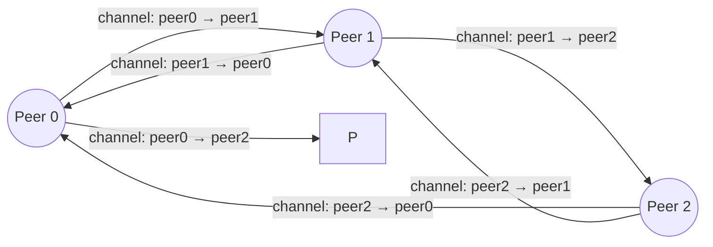
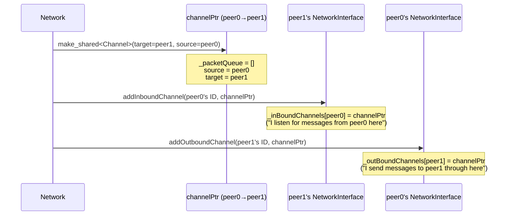
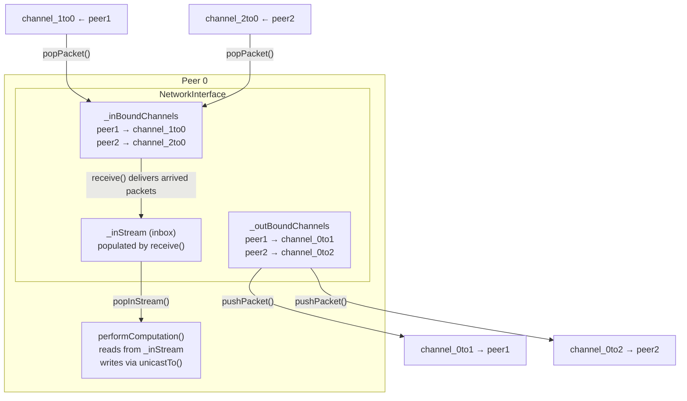

# Channel Creation — Visual Guide

## Diagram 1: 3-peer complete network after createInitialChannels()

Each arrow is one Channel object (one directional string).
6 peers × (n-1) neighbors = 3 peers × 2 = 6 channels total.

---

## Diagram 2: What happens when one channel is created (peer0 → peer1)

The same `channelPtr` (one object) gets registered on **both** peers.

---

## Diagram 3: Full picture — peer's NetworkInterface after setup (peer 0, 3-peer network)

