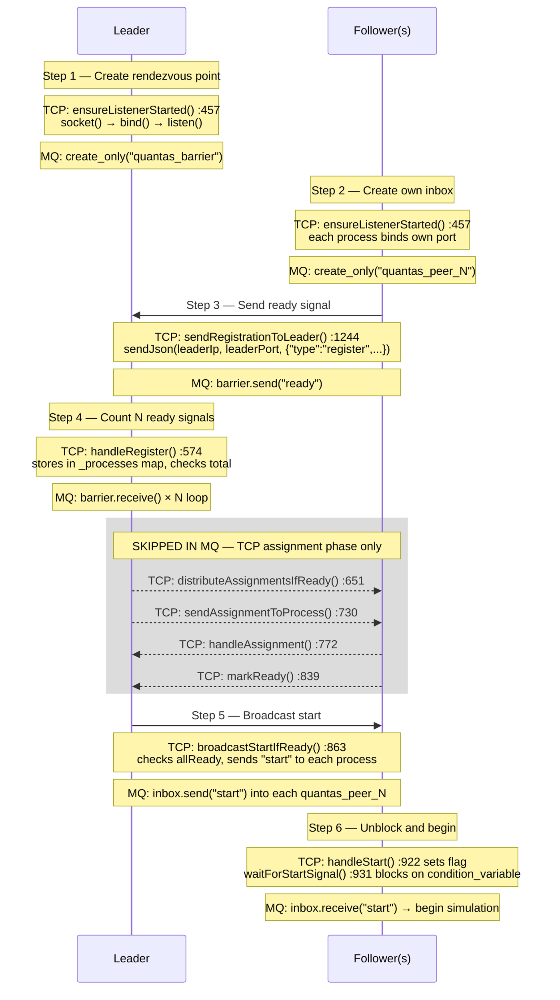
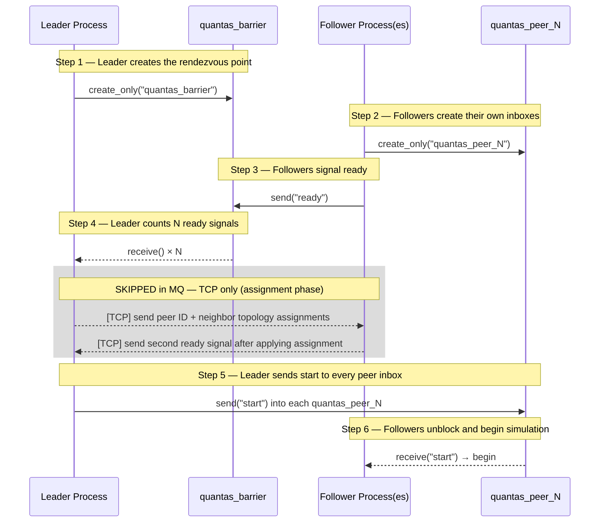

# Rendezvous Protocol — TCP vs Boost MQ

## TCP → MQ Function Reference

## MQ Rendezvous Flow

## Why the assignment phase is skipped in MQ

In TCP, the leader must discover each process's IP and port, assign peer IDs, and broadcast topology — because nothing is known at startup.

In MQ, queue names are derived directly from peer IDs (`quantas_peer_<id>`). Every process already knows how to reach any other peer. No discovery or assignment needed.
